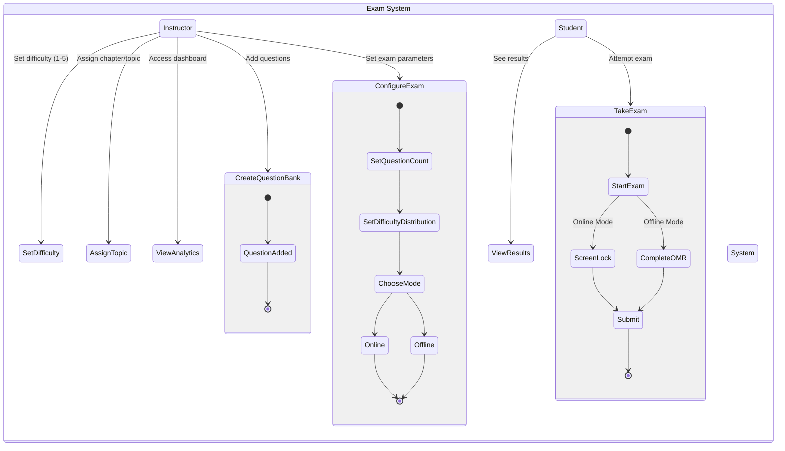

# Online Examination System

## Overview

This is the backend service for the Online Examination System. It provides APIs for managing online examinations, including question banks, randomized exam generation, and performance analytics.

## Features

- Question bank management with difficulty levels (1-5)
- Dynamic exam generation with randomization
- OMR-compatible exam model generation for offline exams
- Performance analytics and student tracking
- Screen lock mechanism for online exams
- Real-time exam monitoring

## Tech Stack

- Node.js
- Express.js
- PostgreSQL
- JSON Web Tokens (JWT) for authentication

## Project Structure

```
backend/
├── src/
│   ├── controllers/        # Request handlers
│   ├── models/            # Database models
│   ├── routes/            # API routes
│   ├── services/          # Business logic
│   ├── middleware/        # Custom middleware
│   └── utils/             # Helper functions
├── public/                # Static files (Frontend build)
├── config/               # Configuration files
├── scripts/              # Utility scripts
└── tests/               # Test files
```

## Team Collaboration Workflow

### Initial Setup (One-time)

1. Fork the repository

   - Go to the main repository: `https://github.com/gazzaar/testnova`
   - Click "Fork" button in the top right
   - Select your GitHub account

2. Clone your fork

```bash
git clone https://github.com/[your-username]/testnova.git
cd testnova
```

3. Add the main repository as upstream

```bash
git remote add upstream https://github.com/gazzaar/testnova.git
```

### Daily Development Workflow

1. Get latest changes from main repository

```bash
git checkout main
git pull upstream main
```

2. Create a feature branch

```bash
git checkout -b feature/your-feature-name
```

3. Make your changes and commit

```bash
git add .
git commit -m "feat: description of your changes"
```

4. Push to your fork

```bash
git push origin feature/your-feature-name
```

5. Create Pull Request
   - Go to your fork on GitHub
   - Click "Pull request"
   - Select your feature branch and the main repository's main branch

### Environment Setup

1. Copy the example environment file

```bash
cp .env.example .env.development
```

2. Update the environment variables in `.env.development`:

```env
PORT=5000
JWT_SECRET=your_secret_here
NODE_ENV=development
CORS_ORIGIN=http://localhost:5173
```

> ⚠️ Never commit your `.env` files to Git. They contain sensitive information and should remain local to your machine.

### Installation

1. Install dependencies

```bash
npm install
```

2. Create the public directory for frontend build

```bash
mkdir -p public
```

3. Start development server

```bash
npm run dev
```

## API Documentation

### Authentication

```
POST /api/auth/login
POST /api/auth/register
POST /api/auth/logout
```

### Question Bank Management

```
GET    /api/questions
POST   /api/questions
PUT    /api/questions/:id
DELETE /api/questions/:id
```

### Exam Management

```
POST   /api/exams/create
GET    /api/exams/:id
POST   /api/exams/generate
GET    /api/exams/models/:count
```

### Results and Analytics

```
POST   /api/results
GET    /api/analytics/performance
GET    /api/analytics/topics
```

## Team Coordination

### Branch Naming Convention

- Features: `feature/feature-name`
- Bug fixes: `fix/bug-name`
- Hotfixes: `hotfix/issue-name`

### Commit Message Format

```
type(scope): description

[optional body]
```

### Before Creating Pull Request

1. Pull latest changes from upstream

```bash
git checkout main
git pull upstream main
git checkout your-feature-branch
git rebase main
```

2. Test your changes

```bash
npm test
```

3. Update documentation if needed

### Handling Conflicts

If you get conflicts when rebasing:

1. Resolve conflicts in each file
2. `git add .`
3. `git rebase --continue`
4. If needed, ask team lead for help

## Scripts Reference

- `npm start`: Start production server
- `npm run dev`: Start development server with hot reload
- `npm test`: Run tests
- `npm run copy-frontend`: Copy frontend build files
- `npm run lint`: Run ESLint

## Common Issues and Solutions

### Frontend Not Loading

- Check if public directory exists
- Ensure frontend build files are copied correctly
- Verify static file serving configuration

### State Diagram


