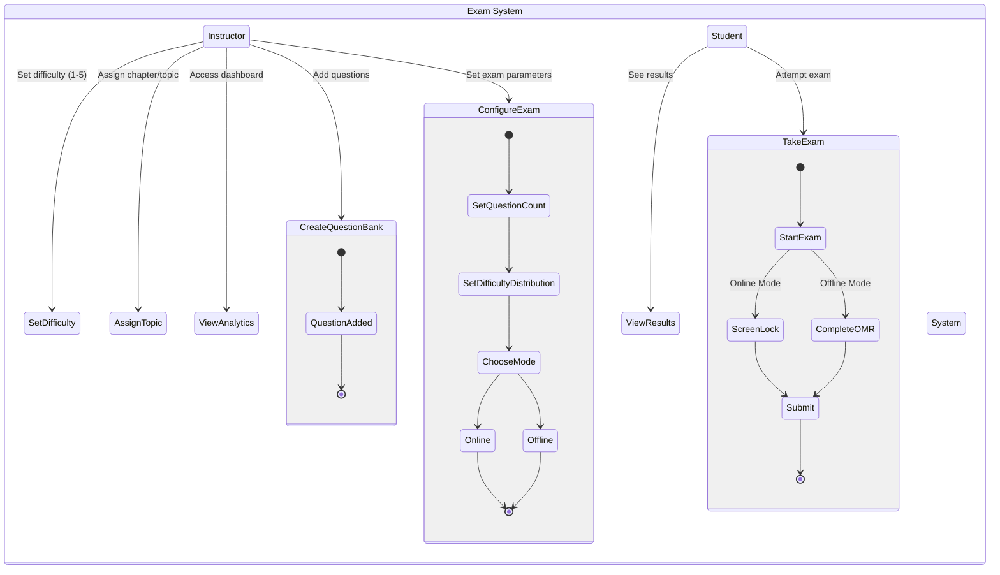

# Test Nova Backend

### State Diagram

```mermaid
stateDiagram-v2
    state "Exam System" as ES {
        state "Instructor" as INST
        state "Student" as STD
        state "System" as SYS

        INST --> CreateQuestionBank: Add questions
        INST --> SetDifficulty: Set difficulty (1-5)
        INST --> AssignTopic: Assign chapter/topic
        INST --> ConfigureExam: Set exam parameters
        INST --> ViewAnalytics: Access dashboard

        STD --> TakeExam: Attempt exam
        STD --> ViewResults: See results

        state CreateQuestionBank {
            [*] --> QuestionAdded
            QuestionAdded --> [*]
        }

        state ConfigureExam {
            [*] --> SetQuestionCount
            SetQuestionCount --> SetDifficultyDistribution
            SetDifficultyDistribution --> ChooseMode
            ChooseMode --> Online
            ChooseMode --> Offline
            Online --> [*]
            Offline --> [*]
        }

        state TakeExam {
            [*] --> StartExam
            StartExam --> ScreenLock: Online Mode
            ScreenLock --> Submit
            StartExam --> CompleteOMR: Offline Mode
            CompleteOMR --> Submit
            Submit --> [*]
        }
    }
```
